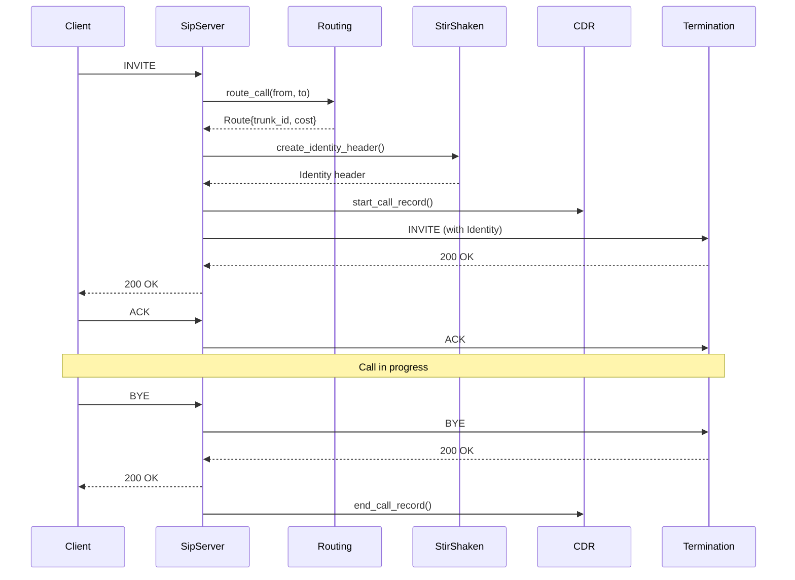
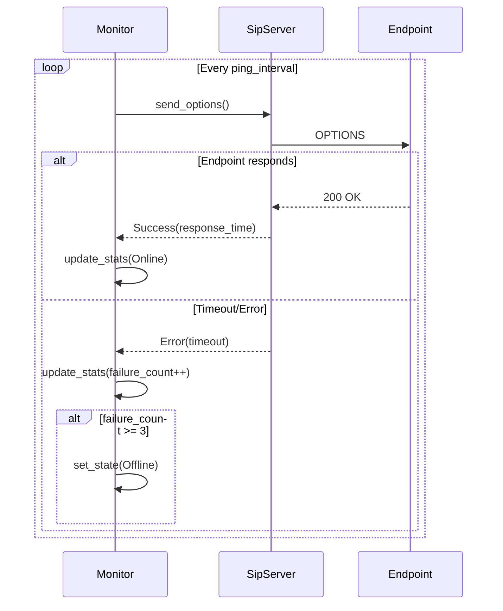
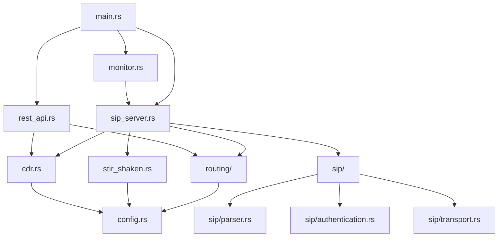

# Redfire Switch Architecture

This document describes the simplified architecture of Redfire Switch, focusing on core SIP functionality and maintainable design.

## 🎯 Design Philosophy

**"Simple First, Scale Later"** - The architecture prioritizes:

1. **Core SIP functionality** over advanced features
2. **Testability** with real SIP tools (SIPp)
3. **Maintainability** over complex abstractions
4. **Performance** when needed, measured not guessed
5. **Operational simplicity** for deployment and debugging

## 📐 Overall Architecture

### High-Level System Design

```
┌─────────────────┐    ┌─────────────────┐    ┌─────────────────┐
│   SIP Clients   │    │ Redfire Switch  │    │  Termination    │
│                 │◄──►│                 │◄──►│   Providers     │
│ • Softphones    │    │ • SIP Server    │    │ • Carriers      │
│ • PBX Systems   │    │ • Call Routing  │    │ • Gateways      │
│ • Applications  │    │ • STIR/SHAKEN   │    │ • Other Switches│
└─────────────────┘    └─────────────────┘    └─────────────────┘
                               │
                       ┌─────────────────┐
                       │   Operations    │
                       │                 │
                       │ • CDR Storage   │
                       │ • Monitoring    │
                       │ • REST API      │
                       │ • Debug Tools   │
                       └─────────────────┘
```

### Core Components

1. **SIP Server** - Message processing and protocol handling
2. **Routing Engine** - Call routing and path selection
3. **STIR/SHAKEN** - Call authentication and verification
4. **CDR System** - Call detail recording and analytics
5. **Monitor** - Health checking and endpoint monitoring
6. **Configuration** - System configuration and management

## 🏗️ Component Architecture

### 1. SIP Server (`src/sip_server.rs`)

**Purpose**: Core SIP protocol handling and message processing

**Responsibilities**:
- UDP/TCP socket management
- SIP message parsing and validation
- Protocol compliance (RFC 3261)
- Transport abstraction
- Connection management

**Key Interfaces**:
```rust
pub struct SipServer {
    profiles: Vec<SipProfile>,
    handlers: MessageHandlers,
}

impl SipServer {
    pub async fn start(&self) -> Result<()>
    pub async fn handle_message(&self, message: SipMessage, from: SocketAddr) -> Result<()>
    pub async fn send_response(&self, response: SipResponse, to: SocketAddr) -> Result<()>
}
```

**Dependencies**:
- `routing::RoutingEngine` - For call routing decisions
- `stir_shaken::StirShakenService` - For call authentication
- `cdr::CdrService` - For call detail recording

### 2. Routing Engine (`src/routing/`)

**Purpose**: Simplified call routing with prefix-based matching

**Responsibilities**:
- Route lookup and selection
- Least Cost Routing (LCR)
- Emergency call routing (911, 112, 999)
- Trunk management and selection
- Basic load balancing

**Key Data Structures**:
```rust
pub struct Route {
    pub prefix: String,
    pub trunk_id: String,
    pub priority: u32,
    pub cost: f64,
}

pub struct RoutingEngine {
    routing_table: RoutingTable,
}

impl RoutingEngine {
    pub async fn route_call(&self, from: &str, to: &str) -> Result<Route>
    pub fn add_route(&mut self, route: Route)
    pub fn remove_routes(&mut self, prefix: &str)
}
```

**Algorithm**: Simple longest-prefix-match with cost optimization
```
1. Extract dialed number from INVITE
2. Find all matching prefixes (longest first)
3. Select route with lowest cost
4. Return trunk information for forwarding
```

### 3. STIR/SHAKEN Service (`src/stir_shaken.rs`)

**Purpose**: Call authentication using JWT PASSporT tokens

> **Note**: This module was preserved from the original implementation as it was functional.

**Responsibilities**:
- JWT token creation and verification
- X.509 certificate management
- SIP Identity header generation
- Call attestation levels (A, B, C)
- Certificate validation and CRL checking

**Key Operations**:
```rust
impl StirShakenService {
    pub fn create_passport(&self, call_info: &CallInfo) -> Result<String>
    pub async fn verify_passport(&self, token: &str, cert_url: &str) -> Result<Claims>
    pub fn create_identity_header(&self, call_info: &CallInfo) -> Result<String>
    pub async fn validate_call(&self, identity: &str, from: &str) -> Result<Attestation>
}
```

### 4. CDR System (`src/cdr.rs`)

**Purpose**: Call Detail Recording with high-performance storage

**Responsibilities**:
- Call record generation
- ClickHouse database storage
- CSV backup and rotation
- Real-time statistics
- Performance metrics

**Storage Strategy**:
- **Primary**: ClickHouse for analytical queries
- **Backup**: CSV files with compression and rotation
- **Real-time**: In-memory statistics for monitoring

**CDR Fields**:
```rust
pub struct CallDetailRecord {
    pub call_id: String,
    pub from_number: String,
    pub to_number: String,
    pub start_time: DateTime<Utc>,
    pub end_time: Option<DateTime<Utc>>,
    pub duration_seconds: Option<u32>,
    pub termination_cause: Option<String>,
    pub trunk_id: Option<String>,
    pub cost: Option<f64>,
    pub stir_shaken_verified: bool,
    // ... additional fields
}
```

### 5. Monitor (`src/monitor.rs`)

**Purpose**: SIP endpoint health monitoring using OPTIONS ping

**Responsibilities**:
- Periodic SIP OPTIONS requests
- Response time measurement
- Endpoint state tracking (Online, Offline, Error)
- Success rate calculation
- Failure detection and alerting

**Monitoring Logic**:
```rust
pub struct SipMonitor {
    endpoints: Vec<SipEndpoint>,
    stats: HashMap<String, EndpointStats>,
}

pub enum EndpointState {
    Unknown,    // Initial state
    Online,     // Responding to OPTIONS
    Offline,    // Multiple consecutive failures
    Error,      // Specific error condition
}
```

### 6. Configuration System (`src/config.rs`)

**Purpose**: JSON-based configuration with validation

**Configuration Structure**:
```json
{
  "sip_profiles": [...],    // SIP server configuration
  "routing": {...},         // Routing rules and trunks
  "monitoring": {...},      // Monitoring endpoints
  "stir_shaken": {...},     // STIR/SHAKEN settings
  "cdr": {...},            // CDR storage configuration
  "debug": {...}           // Debug and development options
}
```

## 🔄 Message Flow

### Basic Call Flow



### OPTIONS Ping Flow



## 📁 Module Structure

### Source Code Organization

```
src/
├── main.rs                 # Application entry point and service coordination
├── cli.rs                  # Command-line interface with all subcommands
├── config.rs               # Configuration structures and validation
├── sip_server.rs           # Core SIP server with UDP/TCP support
├── monitor.rs              # SIP OPTIONS monitoring and health checks
├── stir_shaken.rs          # STIR/SHAKEN implementation (preserved)
├── cdr.rs                  # Call Detail Records with ClickHouse
├── sms.rs                  # Simplified SMS via SIP MESSAGE
├── routing/                # Call routing system
│   ├── mod.rs              # Main routing engine (161 lines)
│   ├── core.rs             # Basic routing functions
│   ├── termination.rs      # Termination routing
│   ├── origination.rs      # Origination routing  
│   ├── emergency.rs        # Emergency call routing
│   └── enum.rs             # ENUM DNS routing (future)
├── sip/                    # SIP protocol modules
│   ├── mod.rs              # SIP message types and constants
│   ├── parser.rs           # SIP message parsing
│   ├── authentication.rs   # SIP digest authentication
│   ├── transport.rs        # Transport layer abstraction
│   └── state.rs            # SIP transaction state
├── rest_api.rs             # REST API for management
├── security.rs             # Security and fraud protection
├── billing.rs              # Basic billing integration
└── ...                     # Other supporting modules
```

### Module Dependencies



## 🚀 Performance Considerations

### Concurrency Model

**Async/Await with Tokio**:
- Non-blocking I/O for SIP messages
- Concurrent handling of multiple calls
- Efficient resource utilization

**Shared State Management**:
- `Arc<RwLock<T>>` for shared data structures
- `DashMap` for lock-free concurrent access
- Minimal locking for performance

### Memory Management

**Efficient Data Structures**:
- `HashMap` for routing tables (small to medium scale)
- `BTreeMap` for sorted prefix matching
- String interning for repeated values

**Resource Cleanup**:
- Automatic cleanup of completed calls
- Periodic cleanup of expired data
- Memory-mapped files for large datasets

### Scalability Design

**Horizontal Scaling**:
- Stateless call processing (future)
- Shared database for routing and CDR
- Load balancer integration

**Vertical Scaling**:
- Multi-core CPU utilization
- Efficient memory usage
- I/O optimization

## 🔐 Security Architecture

### Authentication

**SIP Digest Authentication**:
- Challenge/response mechanism
- Configurable realms and users
- Integration with external auth systems

**STIR/SHAKEN**:
- End-to-end call authentication
- Certificate-based verification
- Protection against caller ID spoofing

### Authorization

**IP-based Access Control**:
- Per-profile allowed IP ranges
- CIDR notation support
- Dynamic blacklisting

**Rate Limiting**:
- Per-IP call rate limits
- Sliding window implementation
- Automatic throttling

### Security Monitoring

**Fraud Detection**:
- Unusual call pattern detection
- Geographic anomaly detection
- Volume-based alerting

**Logging and Auditing**:
- Comprehensive security event logging
- Failed authentication tracking
- Suspicious activity monitoring

## 🔍 Debugging and Monitoring

### Debug Mode

**Single Call Processing**:
- Process one call then exit
- Complete message logging
- Packet capture integration
- Step-by-step call flow tracing

**Development Tools**:
- GDB integration for deep debugging
- Valgrind for memory analysis
- Real-time packet monitoring
- SIP message dumping

### Production Monitoring

**Health Checks**:
- SIP OPTIONS ping monitoring
- Database connectivity checks
- Service health endpoints
- Resource utilization monitoring

**Metrics Collection**:
- Call volume and success rates
- Response time percentiles
- Error rates and types
- System resource metrics

**Alerting**:
- Threshold-based alerts
- Trend analysis
- Escalation procedures
- Integration with monitoring systems

## 🧪 Testing Architecture

### Test Strategy

**Unit Tests**:
- Individual module testing
- Mock dependencies
- Edge case coverage
- Performance benchmarks

**Integration Tests**:
- SIPp-based protocol testing
- End-to-end call flows
- Docker-based test environment
- Automated test scenarios

**Performance Tests**:
- Load testing with SIPp
- Stress testing under high load
- Memory and CPU profiling
- Bottleneck identification

### Test Environment

**Docker Composition**:
- Redfire Switch (debug mode)
- SIPp UAC/UAS containers
- Wireshark for packet analysis
- Database containers for testing

**Test Scenarios**:
- Basic call establishment
- OPTIONS ping testing
- Registration flows
- Stress testing scenarios

## 🔮 Future Architecture

### Planned Enhancements

**WebRTC Support**:
- Browser-based SIP clients
- Media transcoding
- STUN/TURN integration
- JavaScript SDK

**High Availability**:
- Active/passive clustering
- Database replication
- Automatic failover
- Health-based routing

**Advanced Routing**:
- Real-time routing updates
- Machine learning integration
- Quality-based routing
- Geographic routing

**Management Interface**:
- Web-based administration
- Real-time dashboards
- Configuration management
- Performance analytics

### Scalability Roadmap

**Phase 1** (Current): Single-instance deployment
**Phase 2**: Horizontal scaling with shared database
**Phase 3**: Distributed architecture with microservices
**Phase 4**: Cloud-native deployment with Kubernetes

## 📋 Design Decisions

### Simplification Rationale

**Removed Complexity**:
- BGP Anycast clustering (over-engineered)
- Video passthrough (placeholder code)
- IMS Core (complex without implementation)
- RCS messaging (modern features without core SIP)

**Kept Essentials**:
- STIR/SHAKEN (functional and important)
- CDR system (well-implemented)
- Basic routing (essential for operation)
- Configuration system (operational necessity)

### Technology Choices

**Rust Language**:
- Memory safety without garbage collection
- Excellent async/await support
- Strong type system
- High performance

**Tokio Runtime**:
- Mature async ecosystem
- Excellent I/O performance
- Wide adoption in networking

**ClickHouse for CDR**:
- Columnar storage for analytics
- High compression rates
- Excellent query performance
- Horizontal scaling capability

**JSON Configuration**:
- Human-readable format
- Good tooling support
- Easy validation
- Wide language support

---

This architecture document reflects the current simplified design focused on core SIP functionality. The architecture will evolve as the project matures, always maintaining the principle of "simple first, scale later."